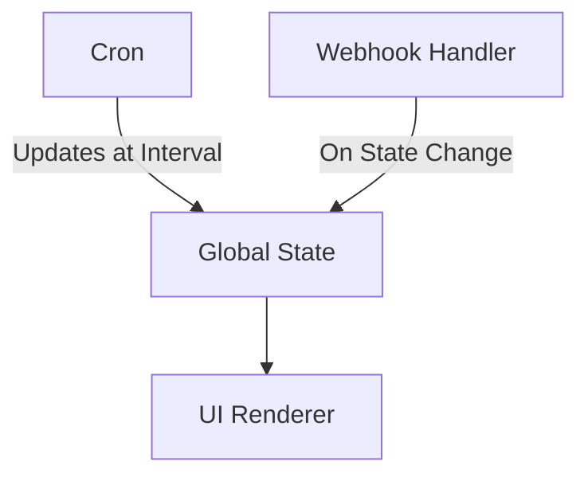

The project can be divided into 2 major components
- UI Renderer (With Graph like viewer)
  - Reads the global information stored in a json file in the local storage (file format can be debated)
  - renders information when the plugin is loaded
- Cron + Webhook Fetcher
  - Fetches Changes on Tabs Open / Closed At a Certain interval
  - Any changes to the Tab State would trigger a caller that updates the global state file
    - while the above seems redundant, it's designed to handle for conditions where the webhook may fail

